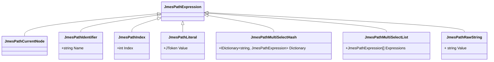

# JMESPath.Net

A fully compliant implementation of [JMESPath](http://jmespath.org/specification.html) for .Net Core.

[](https://ci.appveyor.com/project/jdevillard/jmespath-net/branch/master)
 
# Getting started

## Using the parser

`JMESPath.Net` uses [Newtonsoft.Json](http://www.newtonsoft.com/json) to handle [JSON](http://json.org/)
and comes with a simple to use parser:

```c#
using DevLab.JmesPath;

const string input = @"{ \"foo\": \"bar\" }";
const string expression = "foo";

var jmes = new JmesPath();
var result = jmes.Transform(input, expression);

```

The `JmesPath.Transform` method accepts and produces well formed JSON constructs (object, array or string, boolean, number and null values).
In the example above, the `result` is a JSON string token, including the quotes.

```c#
using Newtonsoft.Json.Linq;

System.Diagnostics.Debug.Assert(result == "\"bar\"");

var token = JToken.Parse(result);
var text = token.ToString();

System.Diagnostics.Debug.Assert(text == "bar");

```

## Exploiting the AST

The previous example return the result of the JMESPath evaluation in a single function call.
The JMESPath.Net parser, however, create an abstract syntax tree with a root [`JmesPathExpression`](./blob/master/src/jmespath.net/Expressions/JmesPathExpression.cs) object used for evaluating JMESPath expression against a JSON document.

If you want to retrieve the AST before performing evaluations, use the following code:

```c#
var jp = new JmesPath();
var ast = jp.Parse(expression);

System.Diagnostics.Debug.Assert(ast is JmesPathExpression);

```

Here is the inheritance hierarchy of `JmesPathExpression` objects:


### Leaf Expressions



### Simple Expressions

A simple expression encapsulates a single instance of another expression named `Expression`.


### Compound Expressions

Compound expressions are a combination of two expressions, named `Left` and `Right`.


