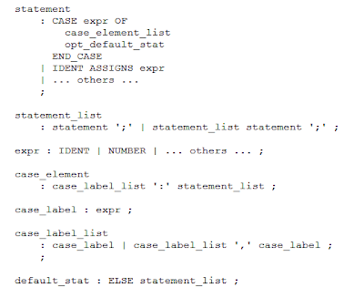
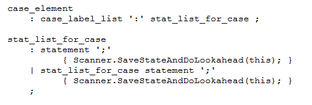
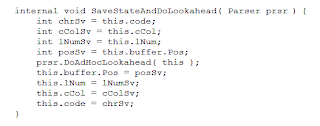
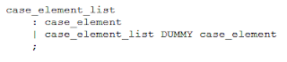

**This article: taken from the following location:**
**http://softwareautomata.blogspot.com/2011/12/doing-ad-hoc-lookahead-in-gppg-parsers.html ** 

_Gardens Point Parser Generator (GPPG)_ and other similar parser generators are limited to a one-symbol lookahead.  However, many programming languages have a few places in their grammars that require a some extra help.  In some cases it is possible to get around the issue with a little transformation of the grammar, but in other cases it is necessary to resort to stronger measures.  Of course if you **_own_** the language that you are parsing, the simplest response is to modifiy the language to make the problem go away, and no-one gets hurt. If somebody else owns the language then the toolkit gets a bit more exercise.

This blog deals with one of those stronger methods, where it is not possible to state in advance the number of symbols that have to be read to decide between two continuations.

Our running example is a grammar for a Pascal-like language which has a problem with the _CASE_ statement, roughly equivalent to **switch** in C-like languages. Here is the base grammar with most of the irrelevant bits missing ...



So, here is the problem - we are parsing the following string and have just read the semicolon, with the identifier "z" as the lookahead symbol ...

```
    CASE foo OF x,y : a := b; z ...
```

How do we know whether the `z` belongs to the current `case_element` (maybe the start of another assignment statement) or is the start of a new `case_label_list`?  Well, we can't tell with one symbol of lookahead.  If we read forward and find a comma or a colon it's a case label; if we find an assignment marker `:=` then it's the start of an assignment. For plausible generalizations of the asssignment left-hand-side grammar the number of lookahead symbols is unbounded.

It is for this reason that most Pascal-like grammars have vertical bar '|' separator between case elements, and C-family languages use the keyword **case** for every label.  However the grammar, as given, is not ambiguous.  Read enough lookahead symbols and the problem is solved.

When a slightly filled-out version of this grammar is fed to **gppg** there is a shift-reduce conflict in one state.  Looking at the diagnostic output from using the /report /verbose options shows that for the state in question, when the lookahead is IDENT, the identifier will be shifted by default, although reduction  `case_label_list ':' statement_list -> case_element` is also valid.  This is the only conflict.

As an aside, note that things could be worse.  Pascal-family languages normally use the semicolon as a separator between statements, rather than as a statement terminator. The base grammar above uses the semicolon as a terminator.  If we simply use it between elements of a statement list then we would have an obvious problem with the string -

```
CASE foo OF x,y : a:= b - z ...
```

Is the `-z` part of the assignment right-hand-side, or the first label of the next case element?

So now we come to the real question: how can we hack on the parser (and scanner) to resolve such problems with the one-symbol lookahead?

The idea is as follows: when the conflict location is reached jump to user-written code that scans forward in the input stream until the matter is decided. Point the parser in the right direction, reset the scanner buffer-position and resume parsing as normal.

The first step is to find a way of inserting the call to the user code in a semantic action.  For our example, whenever a statement list is being parsed in the context of a case statement we should do the _ad hoc_ lookahead.  So we specialize `statement_list` as `stat_list_for_case`.



Now our _SaveStateAndDoLookahead_ method is called every time a new statement is added to the statement list of a case statement.

And what does the method do?  Well, because of some issues with the visibility of various scanner and parser variables we split the code between the scanner and parser.  The scanner code saves scanner state, calls the parser code and restores the scanner state on return.



This code calls the Parser method _DoAdHocLookahead_. This method does the heavy lifting. [However, see the footnote for a bit more on what "save scanner state" implies.]

_DoAdHocLookahead_ will repeatedly call _yylex_ until a decision may be made.  First of all however note that the conflict only arises if the next symbol fetched is an identifier.  For our simple case we exit the loop as soon as we find a symbol that can belong to an assignment but not to a case label list, or to a case label list but not to an assignment.  Simple.  But how do we "point the parser in the right direction" before parsing resumes?

The simplest way of forcing the parser to do the right thing is to overwrite the parser's `NextToken` variable. We use a dummy symbol that otherwise does not occur in the grammar, and rewrite the grammar to rely on that symbol to separate the case_element items.



So that is about all there is to it.  Overwriting the `NextToken` value in the current version of GPPG requires diving into the code of _ShiftReduceParser_ to make the `NextToken` variable accessible. The next refresh of the tool will give the variable protected accessibility to facilitate this technique.

The complete code for this example is available at http://gppg.codeplex.com

Part two will deal with a much harder example: one of the classic syntactic ambiguities of C#.

**Footnote: What "save scanner state" implies, and various disclaimers.**

In the example here the saved state in the scanner is the current "lookahead" character, the current line and column count, and the buffer position. This works for this particular scanner, but others may need more.  In particular, if a scanner has a number of start states, the start state might need to be saved and restored also.  Using the YY_START property is the easiest way of doing this, since it automatically resets the start ordinal _and_ the start state. Of course, for a scanner that has a stack of start ordinals the whole stack needs to be saved and restored.

Furthermore, if the scanner detects and reports lexical errors, errors that are backed-up over may be reported twice.  Thus if you wish to be really picky, you might want to save the high tide on the error buffer and restore that as well.

Alternative strategies will be discussed in the second part.