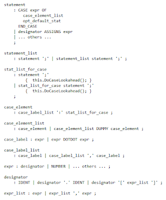
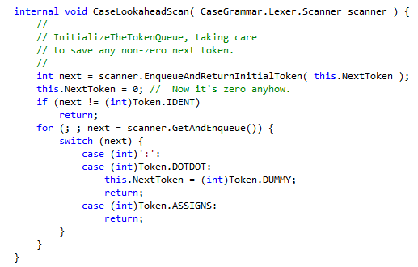
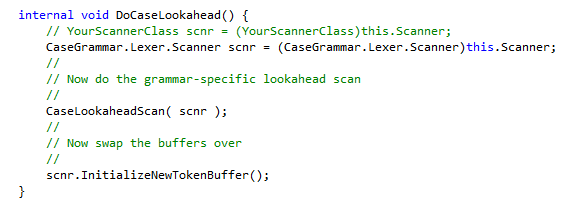
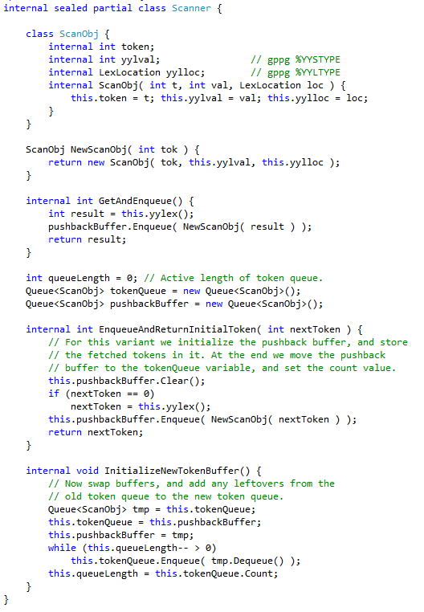
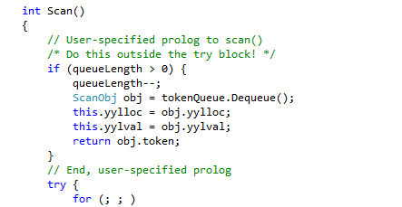

**This article: taken from the following location:**
**http://softwareautomata.blogspot.com/2011/12/doing-ad-hoc-lookahead-in-gppg-parsers.html ** 

Doing _ad hoc_ Lookahead in GPPG Parsers (part-2)
[This is a revised edition of the part-2 post.  An error in the LookaheadHelper code has been corrected, and the example code simplified.  The revised code is also available on CodePlex.]

In the last post a simple method for looking forward in the token stream of a GPPG parser was described.  The key concept was to save the scanner input buffer position, read tokens to resolve the syntactic ambiguity, reposition the input position and then continue. 

There are several limitations on this simple-minded approach.  Firstly, the example relied on being able to restore the scanner state precisely when the input position is backed up.  In cases where the scanner has several different start states this means that extra information needs to be saved and restored.  Secondly, in the case that long lookaheads can occur all of the work done by the scanner is lost when the inut is backed up.  If the scanner creates objects, including instances of the yylloc and _yylval_ types, then this work will be repeated.

In this blog post a different technique is shown.  In this version the scanner defines and produces objects that encapsulate the result of any lookahead-requested call of _yylex_.  These objects contain three data: the integer-valued token result, the semantic value _yylval_, and the location value yylloc.  These objects, as well as being delivered to the decision code that is doing the lookahead, but is also added to an input buffer queue.  When backup is performed, the queue is simply handed back to the scanner.  Subsequent calls of _yylex_ dequeue the saved values, until the queue is exhausted and normal scanning resumes.

In order to give a more realistic setting a modification of the grammar fragment from part-1 ensures that we do really need an unbounded lookahead.  Instead of expressions (and the left hand side of assignments) starting with a bare identifier they begin with a designator.  The designator may have member selection, '.' and array indexing.  Hence we must scan forward until we hit either a colon or a _"dotdot"_, implying we have a case selector; or an _"assign"_ symbol, implying that we are still in the same case statement sequence.  Here is the business part of the new grammar.

This grammar fragment, as in part-1, shows the location of the semantic action that is used to trigger the lookahead _ad hoc_ code.  It also shows the location of the dummy symbol that is injected to terminate the current `case_element` phrase.

Then there is the infrastructure that is used to buffer and unbuffer the lexical data.  Here is the declaration of the class ScanObj.  This can be included inline in the *.lex file, or in a separate _LookaheadHelper_ file.  The following is from a separate file.

And here is the scanner prolog that handles the queue within the scanner's Scan method.

The prolog code is inserted in the *.lex file right after the first `%%` marker, and before the first lexical production.

We can now draw attention to some of the features of the previous code snippet.  Firstly, this code is a very general example.  The enqueuing and dequeuing code allows for the possibility that there may be several _ad hoc_ lookahead locations in the same parser, and that one _ad hoc_ lookahead may consume the enqueued tokens of a previous lookahead.  Note particularly the code that initializes the new token buffer. If the existing code buffer queue is not empty, the leftover tokens in the queue must be added to the end of the newly constructed queue.  There are other structures that achieve the same effect.

Note also that the call to _SaveScannerState_ takes an argument called _nextTokenToSave_.  In part-1 we made use of the fact that for this particular example the `NextToken` value would be empty when the _ad hoc_ lookahead was called.  This allowed us to overwrite `NextToken` to inject the dummy token without any further care.  In general, this is not the case, so the code given above saves the argument if it is non-zero, so that it will be refetched either immediately, or immediately after the dummy token has been consumed.

This infrastructure is shared for all such _ad hoc_ lookaheads, requiring only customization for the various instantiations of the yylloc and _yylval_ types, and the user-chosen scanner namespace and class names.

The bodies of the semantic actions that are called by the parser all conform to the same pattern:

For our running example the method would be DoCaseLookahead, and the body of the lookahead would be the method CaseLookaheadScan.

Note carefully that the lookahead scan must use _GetAndEnqueue_ to fetch tokens, rather than calling _yylex_ directly.  This is to ensure that all the tokens get safely enqueued in the push-back buffer.

Summary

This may look like a lot more code than the example in part-1.  However most of the code is infrastructure, which is shared.  Furthermore this method may be used even with overlapping lookaheads, and cases where the scanner changes start state during a lookahead sequence.  For almost all scenarios this will be more efficient, since the semantic and location value objects created during a lookahead will not be wasted.

Is there anything this second version cannot do?  Well, there is one limitation:  Those grammars where the parser and scanner are tightly linked and the parser changes the scanner start state by calling the scanner's BEGIN method cannot use this method.  This is a very good reason to avoid such program structures.

The only really tricky thing about this method is the responsibility for figuring out how to write a correct _"ExampleLookaheadScan"_ method.  In our present case the occurrence of particular tokens in the lookahead is definitive.

In the final part of this sequence I shall take a really difficult example that arises in the parsing of C#.  A statement sequence may have a `local-variable-declaration` or a `statement-expression`, among other possibilities.  Both of these may start with an identifier and it requires an unbounded lookahead to disambiguate the two.  In this case there are no disjoint sets of tokens that separate the two cases and stronger measures are required. 

The complete code of the example in the current blog entry will go up on the gppg page on CodePlex in the next few days.